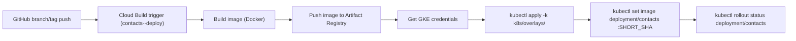
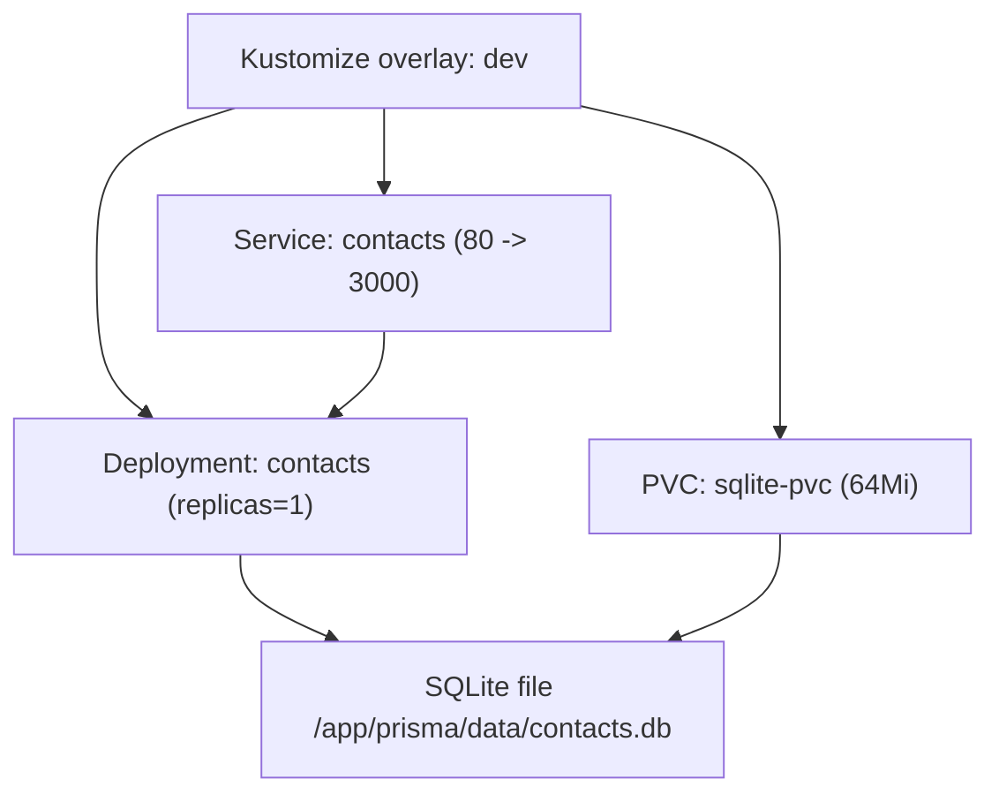
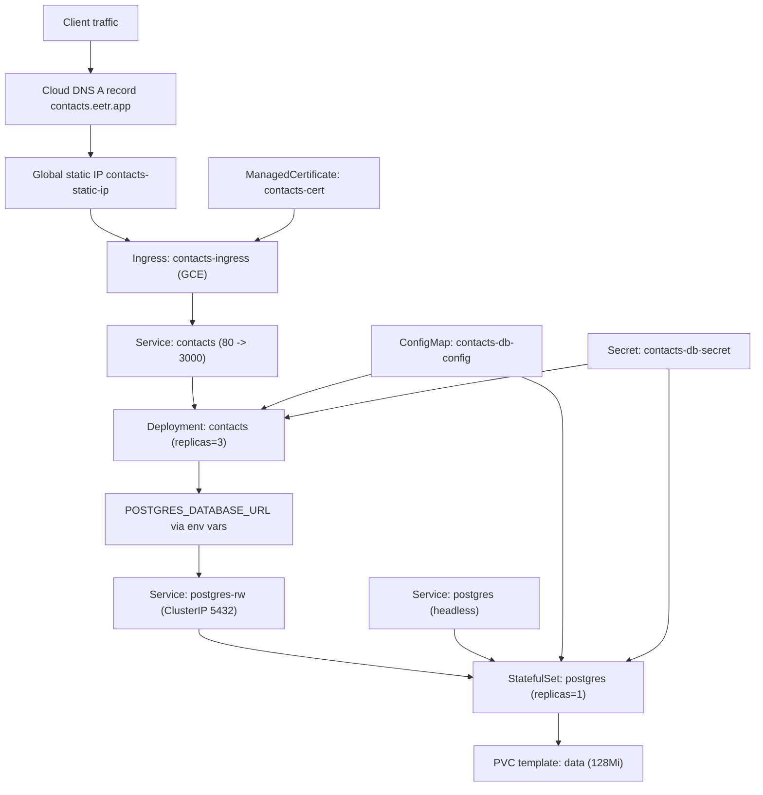

# Deployment Architecture

This document describes how deployments work for both `dev` and `prod` in this repository.

## Scope And Assumptions

- A single Cloud Build trigger is provisioned by Terraform.
- Target environment is selected by Terraform variable `deploy_environment`.
- Cloud Build maps that value to `_K8S_OVERLAY_PATH = k8s/overlays/<env>`.
- Runtime differences are defined in Kubernetes overlays:
  - `k8s/overlays/dev` uses SQLite with a PVC.
  - `k8s/overlays/prod` uses Postgres with StatefulSet, services, ingress, and managed certificate.

## CI/CD Flow (Shared)

## Dev Runtime Architecture (`k8s/overlays/dev`)

### Dev Notes

- App container uses:
  - `APP_DB_ENGINE=sqlite`
  - `SQLITE_DATABASE_URL=file:../data/contacts.db`
- No ingress, managed certificate, or Postgres resources in this overlay.

## Prod Runtime Architecture (`k8s/overlays/prod`)

### Prod Notes

- App reads DB host, port, name, schema, and user from `contacts-db-config`.
- App and Postgres read `POSTGRES_PASSWORD` from `contacts-db-secret`.
- Ingress host is `contacts.eetr.app`, with GCE ingress annotations and managed TLS certificate.

## Resource Inventory

### Terraform (Infrastructure + CI/CD)

- GKE Autopilot cluster: `google_container_cluster.autopilot`
- Cloud Build trigger: `google_cloudbuild_trigger.main_push`
- Runner service account and IAM custom role for Cloud Build:
  - `google_service_account.cloudbuild_runner`
  - `google_project_iam_custom_role.cloudbuild_runner`
- Kubernetes secret created through Terraform Kubernetes provider:
  - `kubernetes_secret_v1.contacts_db_secret`
- Networking for production entrypoint:
  - `google_compute_global_address.contacts_ingress`
  - `google_dns_record_set.contacts_a_record`

### Kubernetes Dev

- `Deployment/contacts`
- `Service/contacts`
- `PersistentVolumeClaim/sqlite-pvc`

### Kubernetes Prod

- `Deployment/contacts`
- `Service/contacts`
- `ConfigMap/contacts-db-config`
- `Secret/contacts-db-secret`
- `Service/postgres` (headless)
- `Service/postgres-rw`
- `StatefulSet/postgres` with `volumeClaimTemplates`
- `Ingress/contacts-ingress`
- `ManagedCertificate/contacts-cert`

## How To Switch Environments

1. Set Terraform variable `deploy_environment` to `dev` or `prod`.
2. Apply Terraform in `infra/terraform`.
3. Cloud Build trigger substitutions set:
   - `_K8S_OVERLAY_PATH = k8s/overlays/${deploy_environment}`
4. On matching branch/tag push events, Cloud Build deploys that overlay.

## Source References

- `cloudbuild.yaml`
- `infra/terraform/trigger.tf`
- `infra/terraform/variables.tf`
- `infra/terraform/main.tf`
- `infra/terraform/networking.tf`
- `infra/terraform/kubernetes-secret.tf`
- `k8s/overlays/dev/kustomization.yaml`
- `k8s/overlays/dev/deployment.yaml`
- `k8s/overlays/dev/contacts-service.yaml`
- `k8s/overlays/dev/pvc.yaml`
- `k8s/overlays/prod/kustomization.yaml`
- `k8s/overlays/prod/deployment.yaml`
- `k8s/overlays/prod/contacts-service.yaml`
- `k8s/overlays/prod/db-configmap.yaml`
- `k8s/overlays/prod/service.yaml`
- `k8s/overlays/prod/postgres-service.yaml`
- `k8s/overlays/prod/statefulset.yaml`
- `k8s/overlays/prod/managed-certificate.yaml`
- `k8s/overlays/prod/ingress.yaml`
