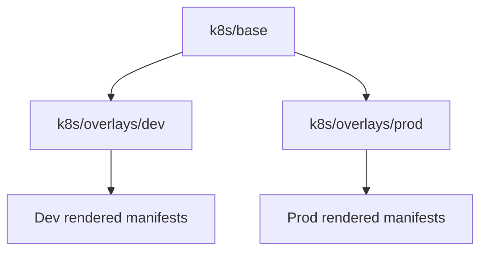

# Deployment Architecture

This document describes how deployments work for both `dev` and `prod` in this repository.

## Scope And Assumptions

- A single Cloud Build trigger is provisioned by Terraform.
- Target environment is selected by Terraform variable `deploy_environment`.
- Cloud Build maps that value to `_K8S_OVERLAY_PATH = k8s/overlays/<env>`.
- Kubernetes manifests are layered with a shared base and env-specific overlays:
  - `k8s/base` defines shared app resources (`Deployment/contacts`, `Service/contacts`, `Job/contacts-migration`).
- Base app deployment defines HTTP health probes (`liveness`, `readiness`, `startup`) against `GET /api/healthcheck`.
- Runtime differences are defined in Kubernetes overlays:
  - `k8s/overlays/dev` uses SQLite with a PVC and exposes `Service/contacts` as `LoadBalancer`.
  - `k8s/overlays/prod` uses Postgres with StatefulSet, services, ingress, and managed certificate.

## CI/CD Flow (Shared)

```mermaid
flowchart LR
  gitPush["GitHub branch/tag push"] --> cbTrigger["Cloud Build trigger (contacts-<env>-deploy)"]
  cbTrigger --> buildStep["Build image (Docker)"]
  buildStep --> pushStep["Push image to Artifact Registry"]
  pushStep --> getCreds["Get GKE credentials"]
  getCreds --> applyOverlay["kubectl apply -k k8s/overlays/<env>"]
  applyOverlay --> reapplyImage["kustomize + sed replace image + kubectl apply"]
  reapplyImage --> runMigration["Delete job, re-apply Job with built image, suspend=false"]
  runMigration --> waitMigration["kubectl wait job/contacts-migration complete"]
  waitMigration --> rollout["kubectl rollout status deployment/contacts"]
```

**Migration job and immutability:** A Kubernetes Job’s `spec.template` is immutable after creation. The pipeline therefore does not use `kubectl set image` for the migration job. It deletes the existing job (if any), then applies the overlay again with the built image substituted into the manifests (via `kubectl kustomize` + `sed`), so the job is created once with the correct image. Deployment image updates still work via the same re-apply.

## Kustomize Layering

## Dev Runtime Architecture (`k8s/overlays/dev`)

### Dev Notes

- App container uses:
  - `APP_DB_ENGINE=sqlite`
  - `SQLITE_DATABASE_URL=file:../data/contacts.db`
- Base `Deployment/contacts` health probes call `/api/healthcheck` on container port `3000`.
- Migration job uses the same env vars and mounts `sqlite-pvc` at `/app/prisma/data`.
- `Service/contacts` is patched to `type: LoadBalancer` for direct external access.
- No ingress, managed certificate, or Postgres resources in this overlay.

## Prod Runtime Architecture (`k8s/overlays/prod`)

### Prod Notes

- App reads DB host, port, name, schema, and user from `contacts-db-config`.
- App and Postgres read `POSTGRES_PASSWORD` from `contacts-db-secret`.
- Base `Deployment/contacts` health probes call `/api/healthcheck` on container port `3000`.
- Migration job reuses the same ConfigMap/Secret env wiring as the app deployment.
- Ingress host is `contacts.eetr.app`, with GCE ingress annotations and managed TLS certificate.

## Resource Inventory

### Terraform (Infrastructure + CI/CD)

- GKE Autopilot cluster: `google_container_cluster.autopilot`
- Cloud Build trigger: `google_cloudbuild_trigger.main_push`
- Runner service account and IAM custom role for Cloud Build:
  - `google_service_account.cloudbuild_runner`
  - `google_project_iam_custom_role.cloudbuild_runner`
- Kubernetes secret created through Terraform Kubernetes provider:
  - `kubernetes_secret_v1.contacts_db_secret`
- Networking for production entrypoint:
  - `google_compute_global_address.contacts_ingress`
  - `google_dns_record_set.contacts_a_record`

### Kubernetes Dev

- `Deployment/contacts`
- `Service/contacts` (`type: LoadBalancer`)
- `Job/contacts-migration`
- `PersistentVolumeClaim/sqlite-pvc`

### Kubernetes Prod

- `Deployment/contacts`
- `Service/contacts`
- `Job/contacts-migration`
- `ConfigMap/contacts-db-config`
- `Secret/contacts-db-secret`
- `Service/postgres` (headless)
- `Service/postgres-rw`
- `StatefulSet/postgres` with `volumeClaimTemplates`
- `Ingress/contacts-ingress`
- `ManagedCertificate/contacts-cert`

## How To Switch Environments

1. Set Terraform variable `deploy_environment` to `dev` or `prod`.
2. Apply Terraform in `infra/terraform`.
3. Cloud Build trigger substitutions set:
   - `_K8S_OVERLAY_PATH = k8s/overlays/${deploy_environment}`
4. On matching branch/tag push events, Cloud Build deploys that overlay.

## Source References

- `cloudbuild.yaml`
- `infra/terraform/trigger.tf`
- `infra/terraform/variables.tf`
- `infra/terraform/main.tf`
- `infra/terraform/networking.tf`
- `infra/terraform/kubernetes-secret.tf`
- `k8s/base/kustomization.yaml`
- `k8s/base/deployment.yaml`
- `k8s/base/contacts-service.yaml`
- `k8s/base/migration-job.yaml`
- `k8s/overlays/dev/kustomization.yaml`
- `k8s/overlays/dev/service-patch.yaml`
- `k8s/overlays/dev/deployment-patch.yaml`
- `k8s/overlays/dev/migration-job-patch.yaml`
- `k8s/overlays/dev/pvc.yaml`
- `k8s/overlays/prod/kustomization.yaml`
- `k8s/overlays/prod/deployment-patch.yaml`
- `k8s/overlays/prod/migration-job-patch.yaml`
- `k8s/overlays/prod/db-configmap.yaml`
- `k8s/overlays/prod/service.yaml`
- `k8s/overlays/prod/postgres-service.yaml`
- `k8s/overlays/prod/statefulset.yaml`
- `k8s/overlays/prod/managed-certificate.yaml`
- `k8s/overlays/prod/ingress.yaml`
